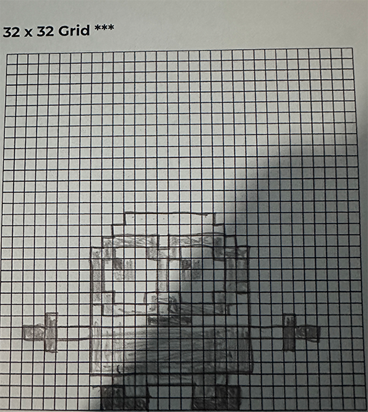

# Unit 1 - Asphalt Art

## Introduction

Cities use asphalt art to improve public safety, inspire their residents and visitors, and brighten communities. Your goal is to create asphalt art to revitalize The Neighborhood and bring the community together with the help of the Painter.

## Requirements

Use your knowledge of object-oriented programming, algorithms, the problem solving process, and decomposition strategies to create asphalt art:
- **Create a new subclass** – Create at least one new subclass of the PainterPlus class that is used for a component of the asphalt art design.
- **Plan an algorithm** – Use the problem solving process and decomposition strategies to plan an algorithm that incorporates a combination of sequencing, selection, and/or iteration.
- **Write a method** – Write at least one method in a PainterPlus subclass that contributes to a component of the asphalt art design.
- **Document your code** – Use comments to explain the purpose of the methods and code segments.

## Notes: Neighborhood & Painter Class

This project was created on Code.org's JavaLab platform using the built in Neightborhood GUI output. To test and edit this project you must build in Code.org's JavaLab with the Neighborhood GUI enabled. For reference to the Painter class documentation, [you can read more here.](https://studio.code.org/docs/ide/javalab/classes/Painter)

## Output:

  . .  

## Reflection

1. Describe your project.

   For my project I decided to draw a Minion after the recent release of the Despicable Me 4. In specific I chose to draw one of my favorite minions which was Bob or sometimes known as KING BOB! You can tell bob apart from other minions because beside the having two eyes and being short he also is heterchromia, meaning he has two different eye colors, one brown and one being green.  I was able to paint Bob by breaking down and writing my own methods such as drawing out different parts like the body, overalls, goggles, eyes, pupils, irises, and combining it in one method. I hope you enjoy my drawing of Bob as much as I did creating him.

2. What are two things about your project that you are proud of?

   Two things Im proud of with my project of my understanding of creating multiple methods in order to break down the process of making Bob. Another thing Im proud about is the string colors, I was able to use the String color multiple times and grab understanding on how to use them for every color come out the way I wanted matching with the methods. Overall Im really proud of the overall project as I had fun making  and coding it. This definitely made an impression on me with the ability to create something you envisioned through code.

3. Describe something you would improve or do differently if you had an opportunity to change something about your project.

   Something I would do differently is the order in which I painted things because I felt sometimes I would have to add more code to back over something than I needed if I planned it out more effectively. I think it was more of knowing more of exactly how I wanted to paint it to be more efficient with my code but Im still happy how it came out

